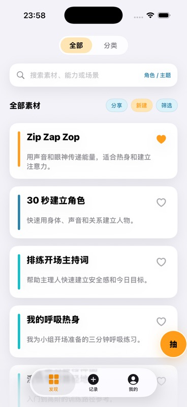
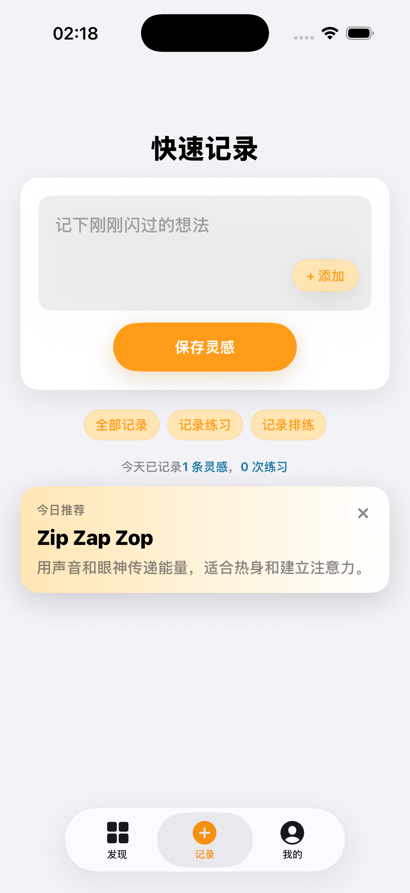
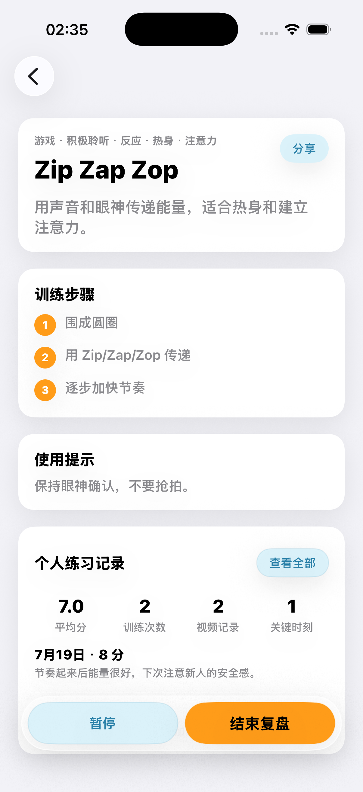
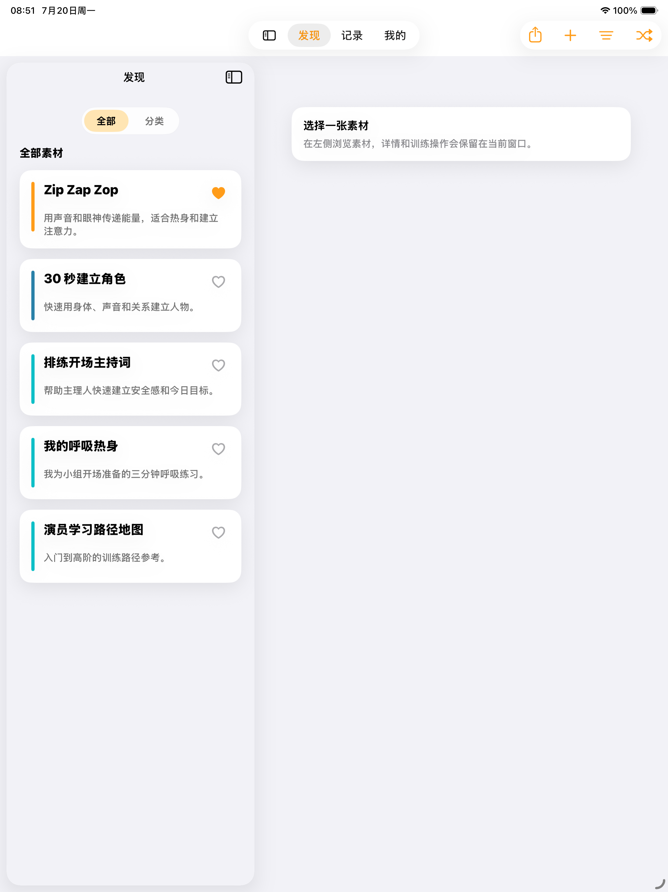
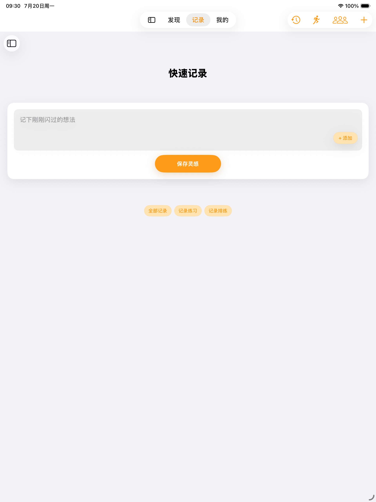
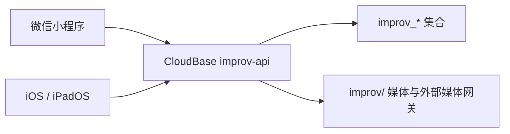

# 即兴工具箱

即兴工具箱是面向即兴表演训练、灵感记录和排练复盘的双端项目。仓库包含微信小程序、iOS/iPadOS 原生客户端，以及两端共享的 CloudBase `improv-api` 和数据契约。

当前状态：源码可构建、可本地预览；生产 CloudBase、Apple 登录、媒体网关、签名与应用商店账号由部署者自行配置，不包含在公开仓库中。

## 产品预览

<p>
  
  
  
</p>
<p>
  
  
</p>

截图只使用示例内容，已重新编码并移除附加元数据。

## 仓库结构

| 路径 | 内容 | 是否可运行 | 许可边界 |
| --- | --- | --- | --- |
| [`apps/wechat-cloudbase/`](apps/wechat-cloudbase/README.md) | 微信小程序、CloudBase 云函数和测试 | 是 | 源码 MIT |
| [`apps/ios-personal/`](apps/ios-personal/README.md) | SwiftUI Universal App、核心模块和测试 | 是 | 源码 MIT |
| [`docs/`](docs/README.md) | 公开产品、架构、数据和版本文档 | 否 | 保留权利 |
| [`releases/ios-personal/`](releases/ios-personal/README.md) | 可公开的 App Store 文案与合规模板 | 否 | 保留权利 |
| [`prototypes/`](prototypes/README.md) | 当前静态交互原型和一个里程碑 | 浏览器打开 | 保留权利 |
| [`data/cloudbase-imports/`](data/cloudbase-imports/README.md) | 8 条素材及私有集合的演示数据 | 用于导入 | 仅开发测试 |
| [`assets/brand/`](assets/brand/README.md) | 品牌权利与使用边界 | 否 | 保留权利 |
| [`archive/`](archive/README.md) | 非公开归档策略说明 | 否 | 不含私有清单 |

## 架构



CloudBase action、字段和权限以 [`apps/wechat-cloudbase/docs/database.md`](apps/wechat-cloudbase/docs/database.md) 为工程事实源；跨端总结见 [`docs/architecture/data-contract.md`](docs/architecture/data-contract.md)。

## 快速开始

微信小程序：

```bash
cd apps/wechat-cloudbase
cp project.config.example.json project.config.json
npm ci
npm run syntax-check
npm run typecheck
npm run contract-check
```

在本地 `project.config.json` 填写自己的微信 AppID。CloudBase envId 保持在本地配置中，不要提交。

iOS/iPadOS：

```bash
cd apps/ios-personal
swift test
swift run ImprovToolCoreValidation
open ImprovToolIOS.xcodeproj
```

未配置 HTTPS endpoint 时应用使用本地预览数据。真实 endpoint 通过本地 Xcode Scheme 环境变量 `IMPROV_CLOUDBASE_API_ENDPOINT` 注入。

## 提交前安全检查

```bash
node tools/check-repository-safety.js
node tools/check-markdown-links.js
git diff --check
```

禁止提交真实 AppID/envId、生产 endpoint、Apple/GitHub/CloudBase 凭据、证书、用户数据和本地开发工具状态。完整规则见 [`SECURITY.md`](SECURITY.md)，贡献流程见 [`CONTRIBUTING.md`](CONTRIBUTING.md)。

## 许可

程序源码、测试和构建脚本采用 [MIT License](LICENSE)。品牌、文案、数据集、截图、设计和发布材料不在 MIT 授权范围内，详见 [`NOTICE.md`](NOTICE.md)。

本次公开版本包含双端个人版、共享 CloudBase 契约、源码级拆分和单仓库分区。历史变化见 [`docs/changelog.md`](docs/changelog.md)。
