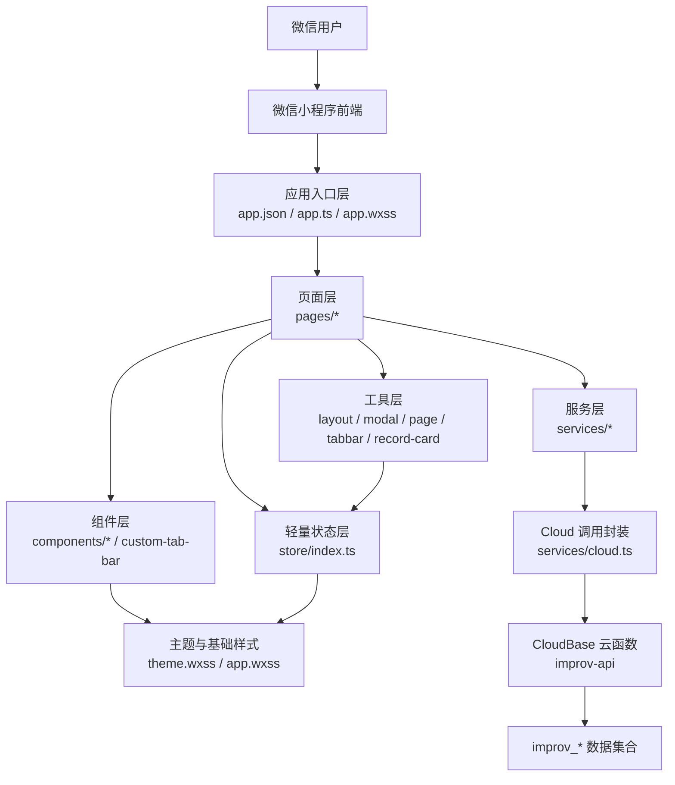

# 架构与 UI 交互体系分析报告

更新时间：2026-06-19

## 1. 分析范围与结论

本报告基于当前工作树扫描 `wechat-cloudbase-app/`、`docs/` 与 `project_memory/` 后整理，目标是为后续 UI 统一、组件复用和交互标准化提供可执行依据。

整改状态：2026-06-19 已按 P0-P2 执行首轮落地。P0 事实源、action 表和废弃组件已处理；P1 已主题化隐私弹窗、统一任务型弹层遮罩关闭并扩展 `state-panel` 语义；P2 已补充素材命名、卡片角色、图标语义和长期维护规则。后续仍可继续按本报告推进更大范围的视觉 debt 清理。

当前项目总体架构方向正确：微信原生小程序 + Skyline + Glass-Easel + CloudBase 聚合云函数 + 轻量 store，适合 MVP 阶段的临场工具定位。主要问题不在技术选型，而在实现口径漂移：页面数量、数据 action 文档、组件命名、卡片角色、主题 token 覆盖、图标与弹层交互存在不一致。

优先整改方向：

1. 先修正事实源不一致：页面数量、`database.md` action 表、无引用组件、语音组件遗留。
2. 再统一 UI 基础设施：卡片角色、按钮层级、半弹窗关闭规则、错误/空态/加载态。
3. 最后做视觉规范化：减少页面级硬编码色值、收敛字号/圆角/间距 token、统一图标体系。

## 2. 项目架构拓扑与模块职责

### 2.1 技术栈选型

| 维度 | 当前实现 | 说明 |
| --- | --- | --- |
| 前端形态 | 微信小程序原生页面/组件 | 未引入 Taro、React、Vue 或大型 UI 框架。 |
| 渲染/组件 | Skyline + Glass-Easel | `app.json` 已配置 `renderer: "skyline"`、`componentFramework: "glass-easel"`。 |
| 语言 | TypeScript + JavaScript 混合 | 新组件/页面逐步使用 `.ts`，历史页面仍有 `.js`。 |
| 样式 | WXSS + `--improv-*` 主题 token | `frontend/styles/theme.wxss` 是主题变量中心，部分页面仍有硬编码。 |
| 后端 | CloudBase 聚合云函数 | 单一 `improv-api` action 路由。 |
| 数据 | `improv_` 前缀集合 | 素材、用户素材状态、灵感、排练、练习记录、方法卡、资料。 |
| 状态 | 自定义轻量 store | 业务数据以内存态为主，UI 偏好和活跃 session 有本地 Storage。 |

### 2.2 架构拓扑图

### 2.3 前端模块分层

| 层级 | 位置 | 主要职责 | 当前问题 |
| --- | --- | --- | --- |
| 应用入口层 | `frontend/app.json`、`app.ts`、`app.wxss` | 页面注册、TabBar、云环境初始化、全局布局/按钮/卡片/输入基线。 | 已修正文档页面矩阵为 11 个页面。 |
| 页面层 | `frontend/pages/*` | 页面数据拼装、交互流程、弹层状态、导航。 | 页面局部卡片和样式较多，部分页面重复定义卡片结构。 |
| 组件层 | `frontend/components/*` | 卡片、弹层、表单、搜索、筛选、空态、记录详情。 | 无引用 `voice-field` 与空 `tag-chip` 已移除；组件与页面命名已统一到素材和练习语义。 |
| 服务层 | `frontend/services/*` | CloudBase action 封装、返回归一、业务接口。 | 已补齐 `database.md` 和 `data-api.md` 的 update/delete action 表。 |
| 状态层 | `frontend/store/index.ts` | 订阅、内存态、主题偏好、pending 标记、活跃 session。 | session 使用 Storage 持久化，与“业务数据不把本地缓存作为事实源”需要在文档中明确区分。 |
| 类型层 | `frontend/types/domain.ts` | Material、Record、Session、AppState 等领域类型。 | `RecordCardViewModel` 已抽象，但卡片角色未完全覆盖页面内自定义卡。 |
| 工具层 | `frontend/utils/*` | layout、modal、toast、record-card view model、tabbar。 | toast 已统一；任务型弹层已开始显式使用 `closeOnMask=false`。 |

### 2.4 核心业务模块

| 模块 | 页面/组件/服务 | 职责 |
| --- | --- | --- |
| 素材发现 | `pages/discover`、`material-card`、`material-form`、`material.ts` | 多类型素材浏览、筛选、分类、抽卡、添加/编辑素材。 |
| 素材详情与训练 | `pages/material-detail`、`pages/practice-feedback`、`practice-record.ts` | 查看素材、收藏/练过、开始/暂停/结束练习、保存复盘。 |
| 快速记录 | `pages/record`、`today.ts`、`inspiration.ts` | 灵感草稿、快速开始练习/排练、今日聚合。 |
| 排练过程 | `pages/rehearsal-record`、`pages/rehearsal-review`、`rehearsal.ts` | 活跃排练计划、素材状态、Keep/Try、整体复盘。 |
| 个人沉淀 | `pages/mine`、`record-card`、`asset-detail-panel`、`method-card.ts` | 方法卡、待整理、灵感记录、资料和主题偏好。 |
| 历史回看 | `pages/practice-records`、`pages/team-records`、`record-detail-panel` | 练习记录与排练记录列表、只读详情、删除确认。 |
| 隐私授权 | `privacy-popup`、`pages/privacy` | 隐私授权提示和政策详情。 |

## 3. 组件体系盘点

### 3.1 组件分类与复用情况

| 类别 | 组件 | 复用情况 | 应用场景 | 主要差异/问题 |
| --- | --- | --- | --- | --- |
| 弹层容器 | `bottom-sheet` | 8 个页面 | 筛选、抽卡、添加素材、选择记录、详情 | 已支持 `closeOnMask`；任务型弹层显式禁用遮罩关闭，轻量查看/筛选保留。 |
| 浮层详情 | `floating-card` | 1 个页面 | 我的页待整理/资产详情翻页 | 独立于 `bottom-sheet`，适合沉浸详情，但交互规范需单独定义。 |
| 表单容器 | `form-card` | 6 个页面 | 复盘、编辑、概览、排练信息 | 复用较高，但部分页面仍直接写 `.card block`。 |
| 表单字段 | `form-field` | 7 个页面 + 2 个组件 | label/desc/slot 字段布局 | 输入控件仍靠页面传入 `.app-input`/`.app-textarea`，这是当前合理的半组件化。 |
| 搜索 | `search-bar` | 3 个页面 | 发现、记录弹层、排练添加 | 清空按钮和 hint 统一；搜索提交有 blur/confirm 混用。 |
| 筛选 | `filter-section` | 3 个页面 + `material-form` | 类型、能力、场景、状态、目标 | 支持横向/换行，但页面大量传 `customClass` 修差异。 |
| 空态/状态 | `empty-state-panel` | 8 个页面 | 空列表、同步失败、无结果、无计划、加载中 | 已扩展 `tone=empty/loading/error/notice` 承接 `state-panel` 语义。 |
| 素材卡 | `material-card` | 1 个页面 | 发现页素材列表 | 命名仍为 `material-card`，业务已是 `Material`；详情页和记录页未复用。 |
| 选择卡 | `selection-card` | 3 个页面 | 选择素材、今日记录、关联对象 | 适合操作交互类卡片，已统一 selected/pending/action。 |
| 历史记录卡 | `record-card` | 3 个页面 | 练习、排练、我的页记录列表 | 复用率高，承担 swipe 删除和 action，后续可扩展到更多记录类。 |
| 详情面板 | `asset-detail-panel`、`record-detail-panel` | 3 个页面合计 | 待整理详情、历史记录详情 | 信息展示相近但组件分裂，后续可统一详情区块 token。 |
| 导航头 | `subpage-header` | 8 个页面 | 子页面返回头部 | 复用高，符合安全区规则。 |
| 隐私弹窗 | `privacy-popup` | 3 个 Tab 页面 | 微信隐私授权 | 已接入主题订阅和 token 化样式；遮罩不再等同拒绝。 |
| TabBar | `custom-tab-bar` | 全局 | 三 Tab 主导航 | PNG 图标仍存在；颜色已部分 token 化。 |
| 无引用/遗留 | `voice-field`、`tag-chip` | 0 引用 | 无实际场景 | 已删除 `voice-field` 组件文件并移除 `tag-chip` 空目录。 |

### 3.2 复用率概览

按页面使用数统计：

| 组件 | 页面使用数 | 评价 |
| --- | ---: | --- |
| `bottom-sheet` | 8 | 核心基础设施，应继续强化。 |
| `empty-state-panel` | 8 | 核心基础设施，已扩展为 `state-panel` 语义。 |
| `subpage-header` | 8 | 稳定复用。 |
| `form-field` | 7 | 稳定复用。 |
| `form-card` | 6 | 稳定复用，但页面自定义卡仍多。 |
| `record-card` | 3 | 记录类列表标准组件。 |
| `selection-card` | 3 | 操作选择类标准组件。 |
| `search-bar` | 3 | 需要统一触发时机。 |
| `filter-section` | 3 | 需要减少页面级覆盖。 |
| `material-card` | 1 | 业务重要但复用低，建议重命名/泛化为 `material-card`。 |
| `floating-card` | 1 | 特定详情场景可保留。 |
| `privacy-popup` | 3 | 已主题化。 |
| `voice-field`、`tag-chip` | 0 | 已删除。 |

## 4. 卡片组件分类与现状

### 4.1 卡片类型

| 业务属性 | 当前实现 | 布局结构 | 尺寸/样式现状 | 交互逻辑 |
| --- | --- | --- | --- | --- |
| 数据展示类 | `material-card`、`record-card`、`record-detail-panel`、详情页 `.card block` | 标题 + 描述 + meta/pill + 状态 | 常用 40rpx 圆角、28/40rpx padding；详情页有局部 28/26rpx 变体 | 点击进入详情、收藏、编辑、删除、只读查看。 |
| 操作交互类 | `selection-card`、记录页 `record-hub-card`、排练计划卡 | 标题 + 描述 + selected/action | `selection-card` 28rpx padding；记录页 hub 卡为页面自定义 | 选择、加入、切换状态、继续任务。 |
| 信息通知类 | `empty-state-panel`、`.notice-note-card`、`.state-note-card`、`.sync-pill` | 标题/说明/动作或纯文本 | 空态已组件化；notice/loading/error 仍依赖全局或页面类 | 重试、清空条件、跳转、新建。 |
| 内容聚合类 | 我的页入口卡、发现页分类卡、路径卡、汇总卡 | 标题 + 数量 + 说明 + 入口 | 多为页面自定义，部分使用 `card-surface-nav/content/container` token | 进入列表、打开半弹窗、主题/资料编辑。 |
| 容器表单类 | `form-card`、`form-field`、编辑表单卡 | header + body slot | `form-card` 40rpx padding、32rpx 标题；输入用 `.app-input/.app-textarea` | 保存、取消、沉淀、展开更多。 |
| 浮层详情类 | `floating-card`、`asset-detail-panel` | 遮罩 + 详情卡 + 翻页导航 | 52rpx 圆角、75vh 高度、居中浮层 | 上一个/下一个、沉淀、不再整理、用途标记。 |

### 4.2 主要卡片规范差异

- `material-card` 只有发现页使用，详情页、记录页仍用页面自定义 `.card`，导致素材摘要卡和素材详情卡视觉节奏不同。
- 历史记录已通过 `record-card` 收敛，但 `practice-records` 与 `team-records` 的 summary、loading、notice 仍是页面局部结构。
- 发现页分类卡、路径卡和我的页入口卡都属于导航/聚合入口，但样式分别在页面内实现，卡片层级容易撞脸。
- `selection-card` 同时承担“选择项”和“列表项”，有 selected/action/pending 能力，但尺寸固定性强，长期应明确它只用于选择/加入类场景。
- 卡片 token 已存在：`--improv-card-nav-*`、`--improv-card-reference-*`、`--improv-card-content-*`、`--improv-card-container-*`，但页面并未完全按角色使用。

### 4.3 建议统一卡片标准

| 卡片角色 | 标准用途 | 建议结构 | 建议 token |
| --- | --- | --- | --- |
| `card-nav` | 分类、快捷入口、我的页入口 | 轻标题 + 数量/图标 + 一句说明 | `--improv-card-nav-*` |
| `card-content` | 素材、记录摘要 | Kicker/状态 + title + desc + meta + action | `--improv-card-content-*` |
| `card-reference` | 学习路径、说明型入口 | 标题 + 摘要 + 阶段/标签 + 查看 | `--improv-card-reference-*` |
| `card-container` | 表单、详情、弹层内容块 | header + body slot + optional action | `--improv-card-container-*` |
| `card-state` | empty/loading/error/notice | 状态标题 + 说明 + 1 个主动作 | 复用 card container + state tone |

## 5. 设计风格 Audit

### 5.1 色彩体系

当前默认主题是橙色主品牌、蓝色辅助色、浅色卡片、柔和阴影；`theme-vivid` 已存在。主题 token 覆盖已经具备基础，但存在以下问题：

- `privacy-popup` 仍大量使用 `#ffffff`、`#1a1a2e`、`#4a4a6a`、`rgba(0,0,0,0.5)`，切换主题时会明显割裂。
- `discover/index.wxss`、`app.wxss`、`bottom-sheet`、`floating-card`、`record-card` 仍有直接色值兜底。兜底本身合理，但局部新增色值应避免脱离 token。
- `theme.wxss` 中 token 很丰富，但页面实际使用没有完全映射到角色，导致“有 token，但页面继续自定义卡片层级”。
- `app.json` 的 `tabBar` 仍写死 `color`、`selectedColor`、`backgroundColor`，实际使用自定义 TabBar 时影响有限，但作为配置事实仍应同步 token 口径。

影响范围：主题切换、隐私授权弹窗、发现页分类/路径区、记录卡删除 reveal、浮层导航按钮。

### 5.2 字体层级

当前字号范围较大：页面标题 56-64rpx，卡片标题 32-46rpx，正文 24-30rpx，标签 20-24rpx。总体可读，但层级过多：

- 发现页存在 20、22、24、25、26、28、30、31、32、36、40、48、56、64rpx 等多档，说明页面局部还在做视觉试错。
- `form-card` 标题 32rpx，`material-card.large` 标题 52rpx，记录页标题 60rpx，详情页标题 44rpx，缺少明确的页面/卡片/列表标题 token。
- 字重普遍偏重，`font-weight: 900` 高频使用，容易让导航卡、内容卡、操作卡视觉同权。

建议字号 token：

| 层级 | 建议值 |
| --- | --- |
| 页面大标题 | 56rpx / 900 |
| 页面次标题 | 40rpx / 900 |
| 卡片标题 | 32rpx / 900 |
| 列表标题 | 30rpx / 800 |
| 正文 | 26rpx / 600，line-height 1.55 |
| 辅助说明 | 24rpx / 600，line-height 1.45 |
| 标签/按钮小字 | 22-24rpx / 800-900 |

### 5.3 间距与圆角

优势：

- 全局已有 `--page-side`、`--page-bottom`、`--fixed-action-*`、`--improv-card-padding-*`。
- `form-card`、`material-card`、`record-card` 已开始复用 40rpx 卡片 padding。

问题：

- 页面局部仍大量出现 18、20、22、24、26、28、32、34、40、48rpx 等间距，缺少小/中/大/区块级标准。
- 圆角从 16、22、24、26、28、30、32、34、40、42、44、46、52、56、58rpx 到 999rpx 均有使用，视觉语言不够收敛。
- 底部固定操作区存在 `form-actions`、`fixed-actions`、`action-stack` 等多套语义，长期会导致安全区 spacer 和按钮对齐漂移。

建议间距 token：

| 场景 | 标准 |
| --- | --- |
| 页面左右 | `--page-side` 40rpx |
| 卡片内边距 | 40rpx，紧凑卡 28rpx |
| 相关元素 gap | 12-16rpx |
| 字段组 gap | 28-36rpx |
| 区块 gap | 48rpx |
| 卡片圆角 | 40rpx，紧凑卡/内嵌块 28-32rpx，sheet 44rpx，pill 999rpx |

### 5.4 图标风格

当前图标来源混合：

- TabBar 使用 PNG。
- 搜索、返回、关闭、骰子、收藏使用文本符号或 emoji：`⌕`、`←`、`✕`、`🎲`、心形。
- 业务图标没有统一尺寸、线宽、可变色策略。

影响范围：TabBar、搜索框、返回头、半弹窗关闭、发现页抽卡 FAB、收藏按钮。

建议：短期统一文本符号尺寸和颜色 token；中期将常用图标收敛为纯 CSS/SVG 组件，至少覆盖 search/back/close/favorite/random/share。

## 6. 交互逻辑标准化分析

| 交互行为 | 当前实现 | 不一致问题 | 标准化建议 |
| --- | --- | --- | --- |
| 按钮点击态 | 全局按钮有 `:active scale(0.98)`；卡片有 `hover-class` | 已开始收敛，但仍需防止页面新增私有按钮色值 | 按 7 类语义使用 `.primary-btn`、`.ghost-btn`、`.small-btn` / `.button-tertiary`、`.mini-action-btn.neutral`、`.mini-action-btn.primary-lite`、`.chip`、`.button-danger-quiet`，页面只补布局。 |
| 表单提交反馈 | 多数页面用 `toast()`；保存失败写入 pending | pending 文案有“本地暂存/待同步/本地保存”混用 | 成功：已保存；云失败但保留：已保存到本次会话，待同步；卡片状态：本地暂存。 |
| 弹窗唤起 | `bottom-sheet` + `root-portal` 为主，`floating-card` 为详情 | `bottom-sheet` mask 点击关闭，与规范“背景不可点击”冲突；隐私弹窗 mask 点击拒绝过重 | 任务型弹层 mask 不关闭，仅关闭按钮；轻量筛选/抽卡可配置关闭；隐私弹窗 mask 不应等同拒绝。 |
| 页面跳转 | `navigateTo` 子页面，`switchTab` 回主 Tab | 基本统一 | 保持：深读/完整编辑进子页，轻选择进 sheet。 |
| 异常提示 | `notice-note-card`、`state-note-card`、`empty-state-panel` | empty 组件化，loading/error 未组件化 | 增加 `state-panel` 或扩展 `empty-state-panel` 支持 `tone=loading/error/empty`。 |
| 删除确认 | 历史记录/素材使用 `wx.showModal` | 系统模态视觉与自定义 UI 不一致，但危险操作适合强确认 | 短期保留系统确认；中期做统一 `confirm-sheet`。 |
| 输入更新 | 表单基本使用 `bindblur`/`bindconfirm` | 搜索也依赖 blur/confirm，实时筛选体验较慢但符合中文输入安全 | 表单继续禁用实时 `bindinput`；搜索可保留 confirm/blur，若要实时搜索需单独验证中文输入。 |
| TabBar 与弹层 | `utils/modal.js` 控制 modalOpen/TabBar | 依赖页面正确调用 open/close 工具 | 所有新弹层必须通过 modal 工具或 `bottom-sheet` 标准状态管理。 |

## 7. 现存关键问题清单

### P0：事实源和废弃物（已完成）

1. `docs/project-context.md`、`project_memory`、`information-architecture.md` 已修正为 11 个页面，并补充 `pages/privacy/index`。
2. `wechat-cloudbase-app/database.md` 和 `docs/data-api.md` 已补齐当前云函数支持的 `inspiration.update/delete`、`methodCard.update/delete`、`rehearsal.delete`、`practiceRecord.update/delete`。
3. `components/voice-field` 已删除，符合 ADR-014 “MVP 文本优先、不提供 app 内语音入口”。
4. `components/tag-chip` 空目录已移除。

### P1：UI 体系漂移（首轮已落地）

1. 卡片角色虽然已有 token，但页面内仍存在大量局部卡片：发现页分类/路径、记录页 hub/recommend、详情页 block、我的页入口卡。
2. `privacy-popup` 已主题化，并订阅 `themeClass`。
3. 已建立 `.icon-text` 与 search/back/close/favorite/random 等图标语义类，后续继续替换散落实现。
4. `bottom-sheet` 已用 `closeOnMask` 区分任务型弹层和轻量弹层，任务型弹层不再误触关闭。

### P2：长期维护风险

1. 页面 `.wxss` 仍存在大量硬编码尺寸和直接色值，后续主题迭代成本高；按钮相关新增样式必须使用 `--improv-btn-*` token。
2. 旧游戏语义命名曾广泛存在，现已按 Material 与 PracticeRecord 模型收敛。
3. loading/error/notice 已通过 `empty-state-panel tone` 开始组件化，后续继续替换页面内历史 `notice-note-card`。
4. TypeScript 与 JavaScript 混合是可接受的迁移状态，但新逻辑应优先 TS，避免类型体系停留在局部。

## 8. 落地方案

### 8.1 组件复用优化

短期不引入外部 UI 框架，不重写页面。按“已有组件增强优先”的方式推进：

1. 已删除无引用组件：移除 `tag-chip` 空目录，删除 `voice-field`。
2. 已扩展 `state-panel`：覆盖 loading、empty、error、notice，复用 `empty-state-panel` 的结构和按钮能力。
3. `material-card` 暂不重命名，作为迁移期兼容遗留；新增命名和文档优先使用 `material` 语义。
4. 统一详情面板基础样式：让 `asset-detail-panel` 与 `record-detail-panel` 共用 detail card token、标题、meta、pending 样式。
5. 建立卡片角色 class：`card-surface-nav`、`card-surface-content`、`card-surface-reference`、`card-surface-container` 作为唯一视觉入口。

### 8.2 卡片统一设计标准

执行规则：

- 导航入口卡：轻阴影、28rpx 内边距、标题 30-32rpx、说明 24-26rpx，不承载长正文。
- 内容摘要卡：40rpx 内边距、标题 32rpx、正文最多 2-3 行、meta 用 `meta-pill`。
- 操作选择卡：28rpx 内边距，必须支持 selected、action、pending，但不承担长详情。
- 详情容器卡：40rpx 内边距，允许多段信息，但操作区放到底部或浮层 action 区。
- 状态卡：只允许一个主动作和一个次动作，不在空态里放多个竞争入口。

### 8.3 视觉风格整改路径

1. P0：已将 `privacy-popup` 改为 token 化，并复用主题系统。
2. P1：为字号、间距、圆角增加语义 token；优先替换 `discover`、`mine` 两个页面的局部硬编码。
3. P1：把发现页分类卡、路径卡、我的页入口卡映射到卡片角色 token。
4. P2：逐步收敛直接色值，只保留 Skyline 兼容所需“直接兜底 + var 覆盖”。
5. P2：统一图标组件或图标 class，替换 emoji FAB、搜索符号、关闭/返回符号的散落实现。

### 8.4 交互逻辑标准化规则

1. 所有弹层默认使用 `bottom-sheet`；任务型弹层 mask 不关闭，轻量弹层可配置关闭。
2. 所有普通反馈调用 `toast(title)`；页面不直接创建新 toast 样式。
3. 所有危险操作先确认；短期可用 `wx.showModal`，中期统一为 `confirm-sheet`。
4. 所有表单文本输入继续使用 `bindblur`/`bindconfirm`，避免 Skyline 中文输入问题。
5. 所有新列表必须显式覆盖 loading、empty、error 三态。
6. 所有 fixed 操作栏使用统一 spacer 和 safe-area 规则，不新增页面私有底栏语义。
7. 页面跳转边界保持：完整编辑/深读进子页面，轻量选择/筛选/局部确认进半弹窗。

## 9. 可执行整改优先级清单

### P0：1 天内可完成（已完成）

- 已修正正式文档中的页面数量：当前为 11 个页面。
- 已补齐 `wechat-cloudbase-app/database.md` action 表，与 `improv-api` routes 对齐。
- 已删除 `components/tag-chip`、`components/voice-field`。
- 已将本报告加入 `docs/README.md`，避免分析只停留在聊天记录。

验收：

- 搜索旧页面数量口径时，不再指向当前事实。
- `database.md` action 表覆盖云函数 routes。
- 无引用组件处理后 `npm run syntax-check`、`npm run typecheck` 通过。

### P1：1-2 个迭代（首轮已完成）

- 已主题化 `privacy-popup`。
- 已建立 `state-panel` 语义，替换部分页面内 loading 重复结构。
- 将发现页分类卡、路径卡、我的页入口卡迁移到卡片角色 class。
- 已接入 `bottom-sheet.closeOnMask`，任务型弹层默认不可点遮罩关闭。
- 已梳理图标 class，先统一 search/back/close/favorite/random 的语义入口。

验收：

- `privacy-popup` 除 Skyline / Glass-Easel 兼容 fallback 外，不再出现脱离 token 的色值。
- 新增列表/弹层不再自定义 loading/error 样式。
- 任务型弹层误触遮罩不关闭。

### P2：长期维护

- 命名已收敛到 `material-*` 与 `practice-*`，降低业务模型歧义。
- 页面级 `.wxss` 中新增样式必须优先引用 token，不新增未登记色值和卡片阴影；新增按钮必须先选择按钮语义类，不允许单页重新定义颜色、边框、阴影和圆角。
- 为卡片和交互规范补充轻量设计检查清单，放入 `.codex/rules` 或 `docs/experience-guidelines.md`。
- 对 `discover`、`mine` 做一次视觉 debt 清理，减少局部字号/圆角/间距档位。

验收：

- 新增组件默认有使用场景、props、空态/错误态和主题适配说明。
- 每次 UI PR 至少检查：卡片角色、按钮层级、主题 token、三态、弹层关闭规则。

## 10. 长期维护规范

- 架构事实变更：先改实现，再同步 `docs/architecture.md`、`docs/project-context.md` 和 `project_memory` 受管快照。
- 数据/action 变更：先改云函数与服务层，再同步 `wechat-cloudbase-app/database.md` 和 `docs/data-api.md`。
- UI 规则变更：同步 `docs/experience-guidelines.md`；如果影响组件策略，同步 `docs/architecture.md`。
- 组件新增规则：必须说明所属角色、复用场景、props、主题 token、loading/empty/error 处理方式。
- 页面新增规则：必须注册到 `app.json`，同步信息架构、页面数量和导航边界。
- 设计 audit 周期：每个较大 UI 迭代后检查一次直接色值、无引用组件、重复卡片结构和弹层行为。
