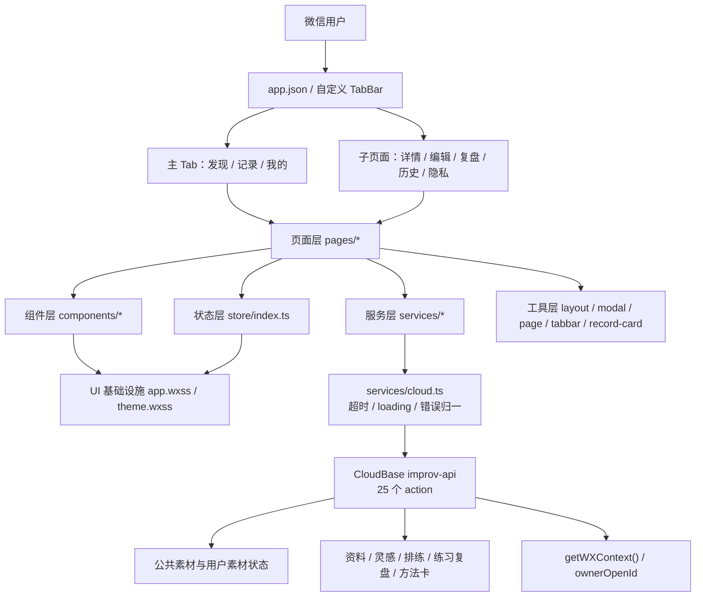
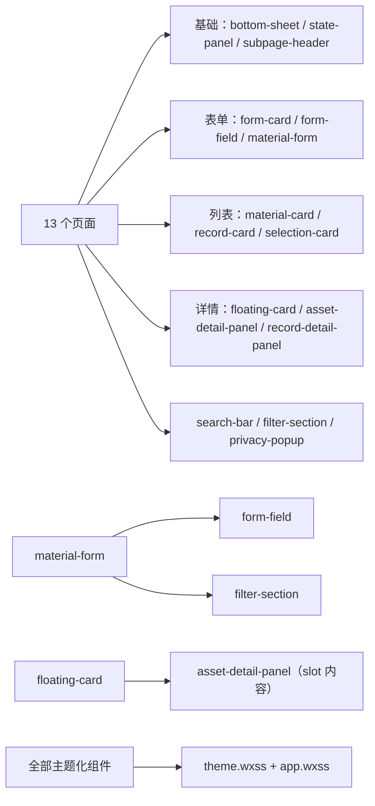

# 架构与 UI 交互体系分析报告

更新时间：2026-06-24

## 1. 审计口径与结论

本报告以 2026-06-20 当前工作树中的生产小程序 `wechat-cloudbase-app/` 为审计对象。`release-support/prototypes/`、`release-support/materials/archive/素材整理/`、`.trae/documents/` 不计入页面、组件和样式统计；它们分别属于探索原型、素材辅助工具和历史归档。

审计覆盖：13 个页面、15 个通用组件、1 个自定义 TabBar、9 个前端服务模块、轻量 store、领域类型、8 个 CloudBase 集合和 29 个云函数 action。结论基于源码静态扫描与微信开发者工具运行态观察；统计结果是当前工作树快照，不代表 Git 基线。

总体判断：

- 技术选型和分层适合 MVP，不需要迁移框架。微信原生小程序、Skyline、Glass-Easel、CloudBase 聚合云函数和轻量 store 的职责边界基本成立。
- UI 已有可复用基础：`bottom-sheet`、`state-panel`、表单容器、记录卡、主题 token 和全局按钮语义均已形成；主要问题是页面私有实现继续增长，导致卡片、尺寸和交互口径漂移。
- 视觉 debt 可量化：WXSS 有 306 个 `--improv-*` token 定义和 538 次 token 消费，但主题文件外仍有 209 个直接色值表达，其中 140 个与 `var()` 同行、可视为 Skyline fallback，另有 69 个未与主题变量绑定；字号 22 档、圆角 23 档、gap 22 档、阴影 36 种表达。
- 当前最高优先级不是重构，而是修复可验证缺陷：方法卡编辑的 2 个 `bindinput` 违反既定中文输入规则；发现页存在 Skyline 不支持的 `max-width: none`；17 个半弹窗的关闭策略虽基本正确，但规范仍依赖调用方自觉。

### 1.1 统计定义

- **注册页面数**：页面 `index.json` 中注册该组件的页面数。
- **页面覆盖率**：注册页面数 / 11。它只用于比较跨页面基础设施，不用于评价专业组件价值。
- **调用点**：WXML 中组件标签出现次数；循环渲染仍计为一个模板调用点。
- **适用覆盖**：组件是否覆盖其应服务的已知场景，采用“完整 / 部分 / 专用”描述，避免用全页面分母误判专业组件。

## 2. 项目架构

### 2.1 技术栈

| 维度 | 当前实现 | 评价 |
| --- | --- | --- |
| 客户端 | 微信小程序原生页面与组件 | 符合产品规模，避免跨端框架成本。 |
| 渲染 | Skyline + Glass-Easel | 已启用；需持续验证 WXSS 兼容性和真机输入。 |
| 语言 | TypeScript + JavaScript | 可接受的渐进迁移状态；新领域逻辑优先 TS。 |
| UI | WXML + WXSS + 自定义组件 | 设计自由度高，但必须靠 token 和审查规则控制漂移。 |
| 状态 | 自定义发布订阅 store | 适合当前规模；业务事实以云端为主，session/UI 偏好例外持久化。 |
| 后端 | CloudBase 单聚合云函数 `improv-api` | 部署简单；action 表是公开接口契约。 |
| 数据 | 7 个 `improv_` 集合 | 公共素材、用户状态与用户私有资产边界清楚。 |
| 工具 | TypeScript 类型检查 + 自定义语法检查 | 缺少自动化 UI lint 和组件单测。 |

### 2.2 架构拓扑

### 2.3 分层职责与依赖约束

| 层级 | 位置 | 职责 | 允许依赖 | 当前风险 |
| --- | --- | --- | --- | --- |
| 应用入口 | `app.json`、`app.ts`、`app.wxss` | 页面注册、云初始化、全局基础样式、网络监听 | config、store | `app.wxss` 已承担较多语义；继续增长会成为全局耦合点。 |
| 页面 | `pages/*` | 页面状态、数据拼装、任务流程、导航 | components、services、store、utils | 局部卡片和样式重复；JS/TS 并存。 |
| 组件 | `components/*` | 可复用结构、事件透传、主题适配 | store（仅主题类）、基础样式 | 部分组件直接订阅主题，主题接入方式不完全一致。 |
| 服务 | `services/*` | action 封装、参数归一、异常归一 | cloud、store、types、constants | 业务调用统一通过 `callImprovData` 抛出错误，页面只处理成功数据或失败态。 |
| 状态 | `store/index.ts` | 订阅、任务互斥、会话态、UI 偏好 | types、constants、Storage | UI 偏好、活跃 session、云端镜像共处一层，需维持清晰边界。 |
| 类型 | `types/domain.ts` | Material、Rehearsal、PracticeRecord、AppState 等契约 | 无 | JS 页面无法获得完整编译期保护。 |
| 工具 | `utils/*` | 安全区、toast、modal、loading、导航辅助、卡片 view model | wx API，少量 store | 统一入口已有，但没有强制 lint 防止页面绕过。 |
| 云函数 | `improv-api/index.js` | 身份识别、action 路由、集合读写、软删除 | CloudBase SDK | 单文件随 action 增长；当前规模尚可，不需提前拆分。 |

依赖规则：页面不得直接调用 `wx.cloud.callFunction`；组件不承担业务数据请求；私有数据 owner 由云函数写入；store 的本地持久化只允许 UI 偏好和未结束 session，不得成为历史业务数据事实源。

### 2.4 核心业务模块

| 模块 | 页面与组件 | 服务 / 状态 | 职责 |
| --- | --- | --- | --- |
| 素材发现 | `discover`、`material-card`、`material-form` | `material.ts`、materials/saved/played | 浏览、搜索、分类、筛选、抽卡、创建素材与路径副本。 |
| 素材详情与练习 | `material-detail`、`practice-feedback` | `material.ts`、`practice-record.ts`、currentMaterial | 收藏、练过、任务计时、结束复盘和方法卡沉淀。 |
| 快速记录 | `record` | `today.ts`、`inspiration.ts` | 灵感快速保存、今日聚合、快速启动练习或排练。 |
| 排练过程 | `rehearsal-record`、`rehearsal-review` | `rehearsal.ts`、currentRehearsal | 计划、素材状态、暂停/继续、Keep/Try、整体复盘。 |
| 个人沉淀 | `mine`、`asset-detail-panel`、`floating-card` | profile/inspiration/method-card services | 资料、主题、待整理、方法卡、灵感筛选与编辑。 |
| 历史回看 | `practice-records`、`team-records`、`record-card` | practice/rehearsal services | 列表、只读详情、删除确认。 |
| 隐私 | `privacy-popup`、`privacy` | 微信隐私 API | 授权说明、拒绝和政策查看。 |

### 2.5 数据与 action

数据流统一为：页面操作 → 业务 service → `callImprovAction()` → `improv-api` action → `improv_*` 集合 → 结构化响应 → 页面/store。当前 action 共 25 个：Material 5、Profile 2、Today 1、Inspiration 4、MethodCard 4、Rehearsal 5、PracticeRecord 4。

7 个集合为：`improv_materials`、`improv_user_material_states`、`improv_profiles`、`improv_inspirations`、`improv_rehearsals`、`improv_practice_records`、`improv_method_cards`。

## 3. 组件体系盘点

### 3.1 组件复用矩阵

| 组件 | 分类 | 注册页面数 / 覆盖率 | 调用点 | 适用覆盖与场景 | 现存差异 |
| --- | --- | ---: | ---: | --- | --- |
| `bottom-sheet` | 模态基础设施 | 8 / 72.7% | 17 | 部分；筛选、抽卡、选择、编辑、详情 | 规格依靠自由 `sheetClass`；任务态需调用方显式禁用遮罩关闭。 |
| `empty-state-panel` | 状态基础设施 | 8 / 72.7% | 17 | 部分；empty/loading/error/notice | 仍有 `.notice-note-card`、`.state-note-card` 页面实现。 |
| `subpage-header` | 导航基础设施 | 8 / 72.7% | 9 | 完整；8 个子页面 | `material-detail` 有两个模板调用点；文本箭头仍属于临时图标方案。 |
| `form-card` | 表单容器 | 7 / 63.6% | 11 | 部分；编辑、复盘、概览 | `record` 已注册但模板未使用；详情页和记录页仍有私有表单/容器卡。 |
| `form-field` | 字段容器 | 7 / 63.6% | 32 | 完整；含 `material-form` 的 8 个调用点 | 原生输入通过 slot 保留，属于合理半组件化。 |
| `filter-section` | 筛选基础 | 3 / 27.3% | 12 | 完整；发现、记录、灵感关联、素材表单 | `customClass/rowClass/chipClass` 较多，需限制为布局覆盖。 |
| `privacy-popup` | 专用授权 | 3 / 27.3% | 3 | 完整；三个主 Tab | 专用组件，不应以全页面覆盖率评价。 |
| `record-card` | 记录摘要 | 3 / 27.3% | 3 | 完整；我的、练习历史、排练历史 | swipe 删除只在有 secondary action 时出现，需补交互可发现性。 |
| `selection-card` | 操作选择 | 3 / 27.3% | 5 | 完整；关联、快速开始、排练添加 | 同时承载 selected/pending/action，职责接近上限。 |
| `search-bar` | 搜索基础 | 3 / 27.3% | 3 | 完整；发现、快速练习、排练加素材 | blur/confirm 触发一致，非实时搜索是中文输入安全取舍。 |
| `material-form` | 业务表单 | 2 / 18.2% | 2 | 完整；创建与编辑素材 | 专用组件，复用价值高于覆盖率。 |
| `record-detail-panel` | 记录详情 | 2 / 18.2% | 2 | 完整；练习与排练只读详情 | 与 `asset-detail-panel` 共享视觉语言但不是同一业务职责。 |
| `asset-detail-panel` | 待整理详情 | 1 / 9.1% | 1 | 专用；我的页待整理 | 包含用途标记和沉淀动作，不宜强行合并记录详情。 |
| `floating-card` | 浮层详情 | 1 / 9.1% | 1 | 专用；待整理翻页容器 | 遮罩点击直接关闭，与任务型 sheet 规则不同，应明确其只读定位。 |
| `material-card` | 素材摘要 | 1 / 9.1% | 1 | 部分；仅发现页列表 | 记录页活跃素材、详情历史仍用私有卡片。 |
| `custom-tab-bar` | 主导航 | 3 个 Tab / 100% Tab 覆盖 | 全局 | 完整；发现、记录、我的 | PNG 与文本图标体系并存。 |

结论：组件不存在“零引用遗留”，但 `record/index.json` 有一条未使用的 `form-card` 注册；复用最稳定的是半弹窗、状态面板、子页头和表单容器。低覆盖不等于低价值，`material-form`、隐私弹窗和详情面板都是合理的业务专用组件。真正的复用缺口集中在页面内卡片和状态提示，而不是组件数量不足。

### 3.2 组件依赖关系

## 4. 卡片体系

### 4.1 分类与现状

| 卡片角色 | 当前实现 | 标准结构 | 当前尺寸/样式 | 交互 | 问题 |
| --- | --- | --- | --- | --- | --- |
| 导航入口 | 分类卡、我的页入口卡 | title + count/icon + 一句说明 | 页面私有；常见 28-40rpx padding | 进入分类、列表或子页 | 仅分类卡使用 `card-surface-nav`；我的页入口未完全映射。 |
| 内容摘要 | `material-card`、`record-card`、历史卡 | kicker/status + title + desc + meta + action | 主卡常见 40rpx padding；紧凑记录卡另有布局 | 打开详情、收藏、编辑、删除 | 素材摘要只有发现页复用；记录摘要较稳定。 |
| 操作选择 | `selection-card`、排练计划卡、记录 hub 卡 | title + desc/meta + selected/action | `selection-card` 采用紧凑容器；页面私有卡尺寸不一 | 选择、加入、继续、切换状态 | 同类场景仍分为组件和页面结构。 |
| 信息状态 | `empty-state-panel`、notice/state note、feedback status | tone + title + desc + 0-2 actions | 组件已支持四种 tone | 重试、清空、新建、跳转 | 3 个页面仍使用 `.notice-note-card`，详情页另有 `.state-note-card`。 |
| 参考聚合 | 路径卡、推荐卡、统计卡 | title + summary + progress/meta + view | 路径、推荐、统计分别实现 | 展开 sheet、查看详情 | 与导航卡视觉容易同权；参考内容需更低强调。 |
| 表单容器 | `form-card`、详情页 `.card block` | header + body slot + optional action | `form-card` 40rpx padding；详情 block 有局部变体 | 编辑、保存、展开更多 | 容器角色已明确，但私有 block 未完全收口。 |
| 浮层详情 | `floating-card` + 两类 detail panel | mask + header + scroll body + action/nav | 52rpx 圆角、约 75vh | 翻页、沉淀、用途标记、关闭 | 只读与任务型浮层边界需写入维护规则。 |

### 4.2 统一卡片标准

| 角色类 | 用途 | 内边距 | 圆角 | 内容限制 | 动作规则 |
| --- | --- | ---: | ---: | --- | --- |
| `card-surface-nav` | 分类、快捷入口、我的页目录 | 28rpx | 28-32rpx | 一行标题 + 一句说明 | 整卡点击，最多一个低强调动作。 |
| `card-surface-content` | 素材、记录摘要 | 40rpx | 40rpx | 摘要 2-3 行，meta 使用 pill | 一个主入口，可附一个状态动作。 |
| `card-surface-reference` | 路径、说明、推荐 | 28-40rpx | 32-40rpx | 只露摘要和关键阶段 | 完整内容进 sheet/子页。 |
| `card-surface-action` | 选择、继续任务、计划项 | 28rpx | 28-32rpx | 明确 selected/pending/status | 状态变化必须有可见反馈。 |
| `card-surface-feedback` | empty/loading/error/notice | 32-40rpx | 32-40rpx | 标题 + 说明 | 最多一个主动作和一个次动作。 |
| `card-surface-container` | 表单、详情、浮层内容 | 40rpx | 40rpx；sheet 44rpx | 可承载长内容 | 操作区与正文分组，不让整卡误触。 |

不得为单页新增同层级卡片颜色、阴影和圆角；需要新角色时先证明现有六类无法表达，再扩展 token 和文档。

移动端布局的底线是内容不能溢出自己的卡片或半弹窗：横向容器统一补 `min-width: 0`，卡片动作区允许换行或收缩，按钮文字单行省略；底部选择列表显式左对齐，避免继承按钮居中；数字徽标等混合字号元素使用垂直居中。此类问题应优先在 `empty-state-panel`、`bottom-sheet` 和列表项组件层修复，而不是在单页用深层选择器补丁。

## 5. 视觉风格 Audit

### 5.1 色彩

当前是奶油浅底、橙色主动作、蓝灰辅助、柔和阴影的双主题体系。量化结果：306 个主题 token 定义、538 次 `var(--improv-*)` 消费；主题文件外有 209 个直接色值，其中 140 个与变量同行，是 Skyline / Glass-Easel 兼容 fallback，69 个没有同行主题变量。

主要影响面：

- `app.wxss`：104 个直接色值表达，其中 33 个未同行绑定变量。全局语义集中是合理的，但未绑定值会影响换色和暗色扩展。
- `discover/index.wxss`：36 个直接色值，其中 18 个未绑定变量，是页面级最高风险。
- `bottom-sheet`：30 个直接色值，其中 10 个未绑定变量；遮罩、sheet 与操作区是主题关键表面。
- `floating-card`、`record-card`、TabBar：仍有少量未绑定直接值。
- `material-card`、`privacy-popup`、`selection-card` 的直接值均与 token fallback 同行，属于兼容写法，不列为违规。
- `mine/index.wxml` 的主题切换入口把 padding、尺寸、背景、文字和边框写在行内；虽然颜色仍使用 token，但绕过了样式角色和审查入口。

规则：允许“直接 fallback → `var(--improv-*, fallback)`”双声明；不允许新增没有语义 token 的品牌色、状态色、遮罩、阴影或卡片表面。

### 5.2 字体层级

当前共有 22 档字号：高频为 24rpx（46 次）、28rpx（27 次）、26rpx（23 次）、22rpx/32rpx（各 12 次）。字重只有 5 档，但 900 使用 67 次、800 使用 22 次，视觉整体偏重。line-height 有 36 种表达，说明正文节奏尚未收敛。

建议层级：

| 语义 | 字号 / 字重 | 行高 |
| --- | --- | --- |
| 页面主标题 | 56rpx / 900 | 1.1-1.2 |
| 页面次标题 | 40rpx / 900 | 1.2 |
| 卡片标题 | 32rpx / 800-900 | 1.25 |
| 列表标题 | 28-30rpx / 800 | 1.3 |
| 正文 | 26rpx / 600 | 1.55 |
| 辅助说明 | 24rpx / 600 | 1.45 |
| 标签与小按钮 | 22-24rpx / 800 | 1.2 |

优先整改发现页 25/31/34/38/46/48/64rpx 等孤立字号；不要机械替换具有明确展示价值的页面主标题。

### 5.3 间距、圆角与阴影

- `gap` 有 22 种表达，高频为 18/16/12/20rpx；18rpx 使用最多但不是现有命名 token 的核心步长。
- 圆角有 23 种表达；999rpx、40rpx、28rpx、24rpx占主要用量，其余 16-58rpx 的零散档位造成风格噪声。
- 阴影有 36 种表达，其中 14 次为 `none`；其余常见阴影已有 token，但页面仍存在一次性参数。

建议步长：相关元素 8/12/16rpx，控件/卡片内部 20/24/28rpx，字段组 36rpx，区块 48rpx；圆角只保留 pill 999rpx、控件 24rpx、紧凑卡 28/32rpx、主卡 40rpx、sheet 44rpx。特殊圆形、头像和业务插画除外。

### 5.4 图标

TabBar 使用 6 张 PNG；搜索、返回、关闭、随机、收藏等使用文本符号/emoji 和 `.icon-text` 语义类。当前问题不是来源混合本身，而是同一语义的字形、线宽、尺寸和点击热区无法稳定一致。

短期继续使用 `.icon-text + .icon-*`，并统一尺寸和热区；中期只替换 back/close/search/favorite/random/share 六个高频图标为同一矢量来源。TabBar PNG 可保留，不要求为形式统一而重做稳定资产。

## 6. 交互逻辑 Audit

| 行为 | 当前证据 | 差异 / 风险 | 标准 |
| --- | --- | --- | --- |
| 点击态 | 全局按钮有 active；仅 3 个 `hover-class` 模板点 | 卡片/入口点击态覆盖不完整 | 命令按钮统一 active；整卡可点击时使用同一 hover/pressed token。 |
| 提交状态 | 5 个 loading、4 个 disabled 绑定 | 部分异步动作没有局部防重；全局 loading 会遮罩所有请求 | 提交按钮必须 loading + disabled；只读加载可用 state panel。 |
| 文本输入 | 普通表单已统一 blur/confirm，全仓无 `bindinput` | 开发者工具 Skyline 模拟器仍无法验证中文组合输入 | 普通表单只用 blur/confirm；中文输入必须真机验证。 |
| 反馈 | 页面统一 `toast()`；2 处 `wx.showToast` 为全局网络提示和兜底 | 已取消无队列支撑的假同步语义 | 成功文案只在服务端确认后显示；失败保留表单并明确重试。 |
| 弹层 | 17 个 `bottom-sheet`；9 个任务型实例显式 `closeOnMask=false` | 默认值允许关闭，任务属性靠调用方维护 | 任务/编辑 sheet 必须禁用遮罩关闭；筛选、抽卡、只读详情可关闭。 |
| 删除确认 | 5 个 `wx.showModal` | 视觉不同但危险确认强度合理 | 短期保留系统确认；不要为统一视觉降低确认强度。 |
| 导航 | 16 navigateTo、10 switchTab、10 navigateBack、1 redirectTo | 基本符合页面边界 | 深读/完整编辑/过程态进子页；轻选择与筛选进 sheet。 |
| 状态 | 17 个 state panel 调用点 | 仍有 notice/state 私有卡；部分页面三态不完整 | 新列表必须显式 loading/empty/error；未入库记录不进入历史列表。 |
| 手势 | record-card 左滑、floating-card 翻页、发现页 FAB 拖动 | 无替代入口时可发现性不足 | 手势必须有按钮或文案替代，不作为唯一完成路径。 |
| TabBar 与 modal | `openModal/closeModal` 控制隐藏 | 调用方绕过工具时可能遮挡 | 新增 modal 必须走统一工具并验证关闭后恢复。 |

## 7. 运行态核验

### 7.1 已验证

微信开发者工具 Stable 运行在 Skyline 模式、iPhone 12/13 模拟器：

- `pages/discover/index` 可渲染；CloudBase 请求超时后进入“添加素材”空态，主卡、主按钮和自定义 TabBar可见，未出现白屏。
- 控制台确认请求超时错误被页面状态承接，但仍保留原始 timeout 日志，说明服务归一和页面空态链路都在工作。
- 控制台报告 `pages/discover/index.wxss` 的 `max-width: none` 为 Skyline 不支持属性，应列入 P0。
- 开发者工具提示未设置线上最低基础库版本，低版本客户端可能回退 WebView；这是发布配置风险，不是本轮 UI 代码整改范围。

### 7.2 证据限制

本地 CloudBase 请求持续超时，且开发者工具窗口自动化无法稳定切换全部路由。因此三个主 Tab、八个子页面的完整数据态、pending、练习/排练任务态和所有 17 个弹层未完成逐一运行态复现。它们在本报告中均以 WXML/WXSS/逻辑源码为证据，不标记为“运行通过”。涉及中文输入、真机安全区、手势和 fixed 操作栏的结论仍需真机回归。

## 8. 可落地统一规范

### 8.1 组件复用

1. 优先增强现有组件，不新增大型 UI 框架。
2. 状态提示全部迁移到现有 `empty-state-panel` 的 `tone` 能力；不再新增 notice/loading/error 私有卡。
3. 素材摘要优先扩展 `material-card` 的 mode，不把详情容器或活跃任务卡强塞进摘要组件。
4. `selection-card` 只承担选择/加入；长详情和复杂状态流使用专用容器。
5. `asset-detail-panel` 与 `record-detail-panel` 保持业务分离，只共享 detail token。

### 8.2 视觉与交互 token

- 色彩：`brand/secondary/text/muted/surface/state/favorite/mask` 语义，不以页面名命名颜色。
- 字体：page-title/section-title/card-title/body/caption/label 七级。
- 间距：space-1/2/3/4/6/8/12，对应 4/8/12/16/24/32/48rpx；现有表单 token 可逐步映射，不要求一次性重写。
- 圆角：control/card-compact/card/sheet/pill 五级。
- 动作：primary/secondary/tertiary/tool/chip/icon/danger 七类；一个任务容器最多一个主动作。
- 状态：loading/empty/error/notice 四类；业务保存以服务端确认为准。

### 8.3 页面与弹层边界

- 子页面：深读、完整编辑、排练过程、复盘和隐私政策。
- 任务型 sheet：单一快速任务，可在当前上下文完成，遮罩不可关闭。
- 轻量 sheet：筛选、抽卡、关联选择、只读详情，允许遮罩关闭。
- 浮层详情：只读浏览和翻页；一旦包含长编辑，升级为 task sheet 或子页面。

### 8.4 长期维护

- 新组件必须记录：角色、适用页面、props/events、主题 token、状态和关闭规则。
- 新页面必须记录：路由、入口/出口、数据源、三态、提交态、fixed 安全区和主题绑定。
- UI PR 必查：直接色值、卡片角色、按钮层级、字体/圆角新档位、图标语义、表单输入事件、弹层遮罩、三态、真机验证。
- 移动端 UI PR 必查：空态双按钮不越界、底部选择面板列表无异常空列、长素材名省略、混合字号徽标垂直居中、页面头部不重复内容卡片标题。
- 每个较大 UI 迭代后复算：组件零引用、页面覆盖率、未绑定直接色值、字号/圆角/gap 档位、私有状态卡、`bindinput`、直接 `wx.showToast`、任务型 sheet 配置。

## 9. 整改优先级清单

2026-06-20 实施更新：两项仓库内 P0（方法卡 `bindinput`、Skyline `max-width: none`）已修复并通过开发者工具重新编译；线上最低基础库仍需在微信后台执行。

| 优先级 | 类型 | 问题与证据 | 影响 | 建议动作 | 依赖 / 工作量 | 验收 |
| --- | --- | --- | --- | --- | --- | --- |
| P0 | 缺陷修复 | `mine/index.wxml` 方法卡编辑有 2 个 `bindinput` | Skyline 中文组合输入可能被打断 | 改为 blur/confirm，并在真机验证中文标题与正文 | 无；0.5 天 | 真机中文输入、保存、再次编辑均正确。 |
| P0 | 缺陷修复 | `discover/index.wxss` 使用不支持的 `max-width: none` | Skyline 控制台告警，存在渲染差异 | 使用支持的布局约束或移除无效声明 | 无；0.25 天 | Skyline 控制台不再出现该告警。 |
| P0 | 发布风险 | 未设置线上最低基础库版本 | 低版本可能回退 WebView | 明确最低版本并做 Skyline/WebView 发布策略 | 发布配置；0.5 天 | 开发者工具不再提示未配置，发布文档同步。 |
| P1 | 规范收敛 | 69 个未同行绑定 token 的直接色值，集中于 app/discover/sheet | 主题扩展与换色成本高 | 先分类兼容值与真实债务，再为真实债务补语义 token | 视觉回归；1-2 天 | 未绑定值下降且两主题无退化。 |
| P1 | 规范收敛 | 22 档字号、23 档圆角、22 档 gap | 层级噪声与页面漂移 | 优先清理 discover/mine 孤立档位，映射推荐层级 | 逐页视觉回归；2-3 天 | 不新增孤立档位，重点页层级清晰。 |
| P1 | 组件复用 | notice/state 私有卡仍在 4 个场景 | 三态结构和文案漂移 | 迁移到 `empty-state-panel tone` | 无；1 天 | 新旧状态路径均由统一组件渲染。 |
| P1 | 组件复用 | 导航/参考/操作卡仍有页面私有表面 | 同屏卡片同权、重复样式 | 将分类、路径、我的入口、record hub 映射到六类卡片角色 | 视觉回归；2-3 天 | 每张卡可明确归类，无新增同级表面。 |
| P1 | 交互统一 | 异步按钮 loading/disabled 覆盖不完整 | 重复提交或反馈不明确 | 按保存/创建/删除 action 建立检查表逐页补齐 | 业务回归；1-2 天 | 所有写操作具备防重和明确结果。 |
| P2 | 工程治理 | `record` 注册但未使用 `form-card`，且存在静态行内样式 | 依赖清单和样式审查噪声 | 移除无用注册，把非动态行内样式迁回页面语义 class | 无；0.5 天 | 页面注册与模板一致，仅动态布局值保留行内。 |
| P2 | 长期演进 | 高频图标来自 PNG、文本、emoji | 线宽、尺寸、主题适配不一致 | 统一六个高频矢量图标；TabBar PNG 保留 | 设计资产；2-3 天 | 高频图标来源、尺寸、热区统一。 |
| P2 | 长期演进 | JS 页面缺少领域类型保护 | 字段迁移更易漏改 | 新增逻辑优先 TS，按实际修改逐页迁移 | 随功能迭代 | 不做独立大迁移；新代码不扩大 JS 债务。 |
| P2 | 工程治理 | 没有 UI lint/组件测试 | 规范依赖人工审查 | 增加只读 audit 脚本和最小组件行为测试 | 工具建设；2-4 天 | CI 可报告新增直接色值、bindinput、零引用组件。 |

## 10. 执行顺序

1. 先完成三个 P0，并做 Skyline + 真机回归。
2. 以“状态面板 → 色彩 token → 卡片角色 → 字体/间距”的顺序推进 P1，避免同时重写全部页面。
3. 每个 P1 子任务独立提交，包含前后截图、受影响页面和回滚边界。
4. P2 随功能迭代执行，不建立脱离产品需求的大型重构分支。

本报告保留审计快照和长期整改路径；2026-06-20 已实施数据链路、错误合同、分页、账号注销和两项 P0 Skyline 修复。

## 11. 2026-06-24 品牌一致性复审

本次以“Zentro｜即兴一下”为目标品牌，复算当前工作树：13 个页面、15 个组件、306 个 `--improv-*` token 定义、582 次 token 使用、225 个 WXSS HEX 表达、17 个半弹窗、10 个显式禁止遮罩关闭的任务弹层。完整证据、页面/组件矩阵和截图阻塞见 [视觉设计一致性审计](reports/visual-design-audit-2026-06-24/README.md)。

结论：现有语义 token、共享按钮、卡片角色、状态面板和 bottom-sheet 可以承接新品牌，不需要引入 UI 框架或复制组件。主要差距不是组件数量，而是当前三套色彩定义与目标品牌不一致、页面级 fallback/直接色值需要重新分类、双主题状态尚未形成可验收矩阵。

整改顺序固定为：

1. P0：把 `default` / `vivid` 明确为“灵感 / 现场”，完成对比度校准和可用测试环境运行态证据。
2. P1：按语义 token 更新主题文件，再回归共享按钮、字段、卡片、弹层和 TabBar；不逐页硬改品牌色。
3. P1：逐页面处理真实直接色值债务、异步防重、状态和动效一致性。
4. P2：统一高频图标、建立自动只读审计和辅助技术专项。

`theme-alt` 只作为历史开发覆盖存在，不进入设置；实施阶段确认无引用后移除。
